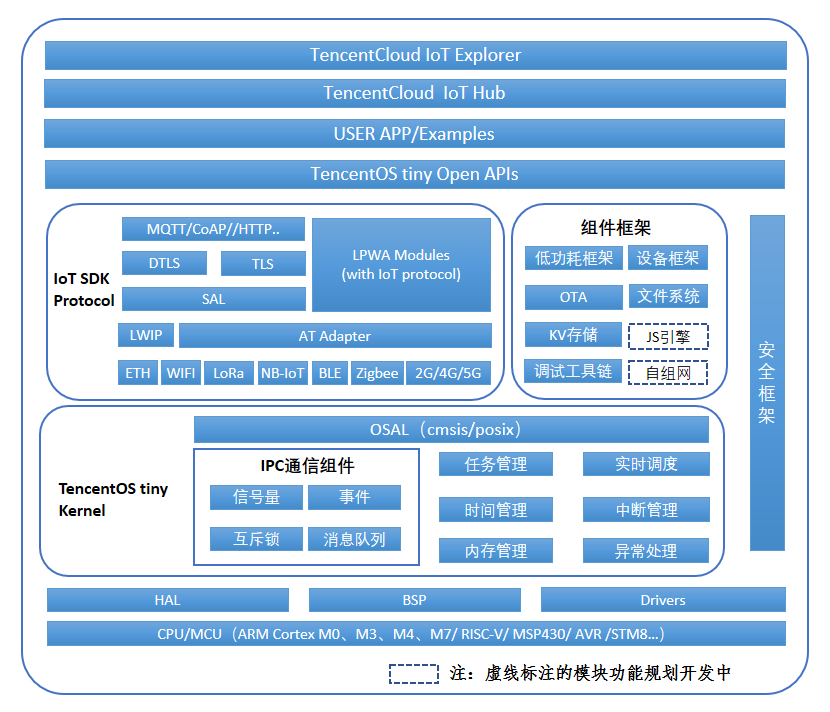
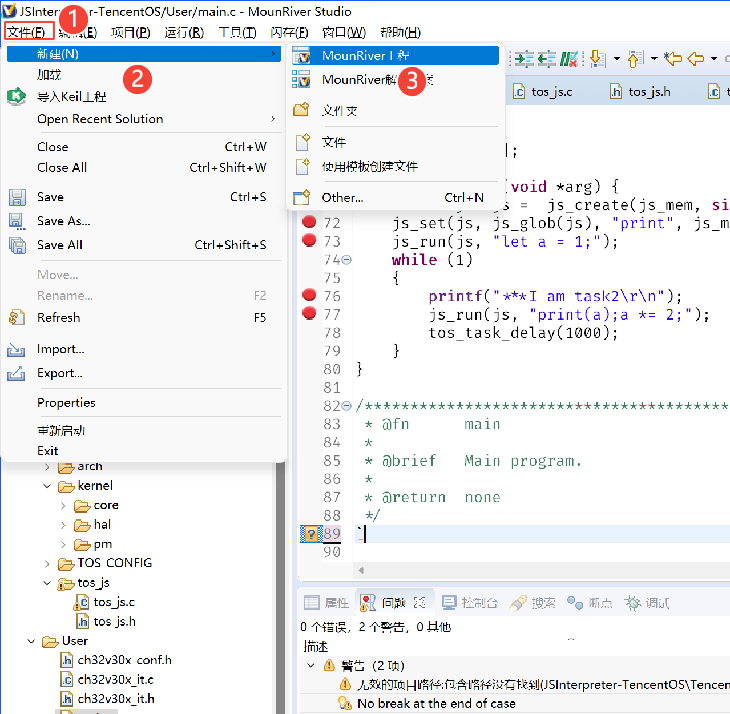
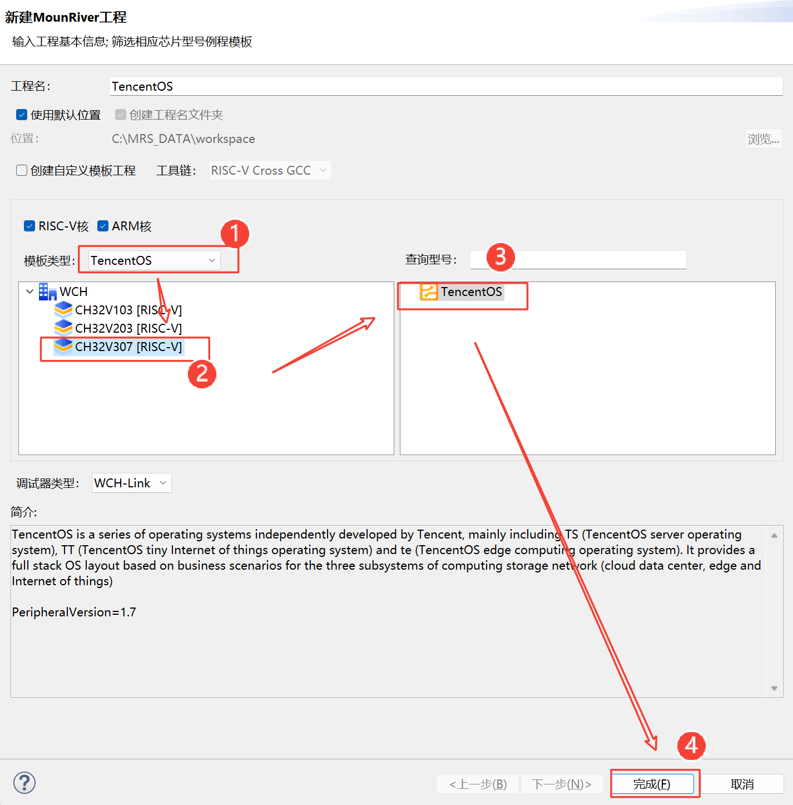
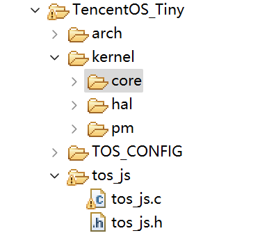
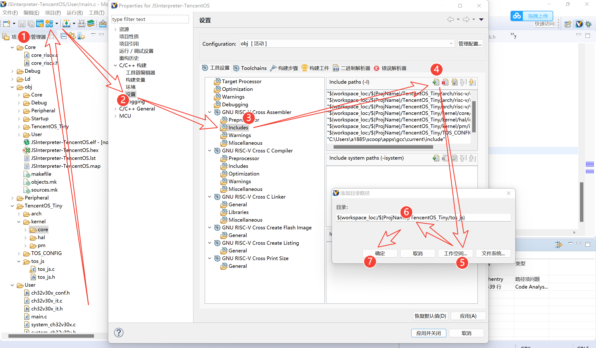
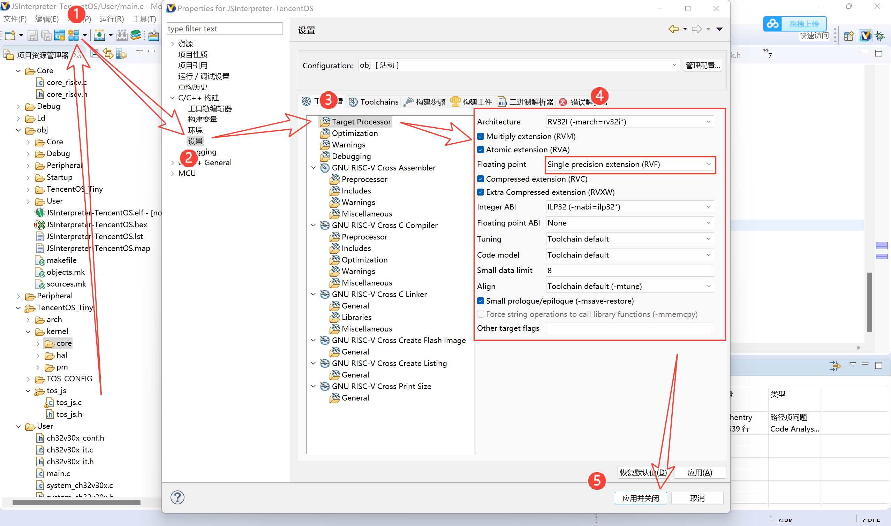
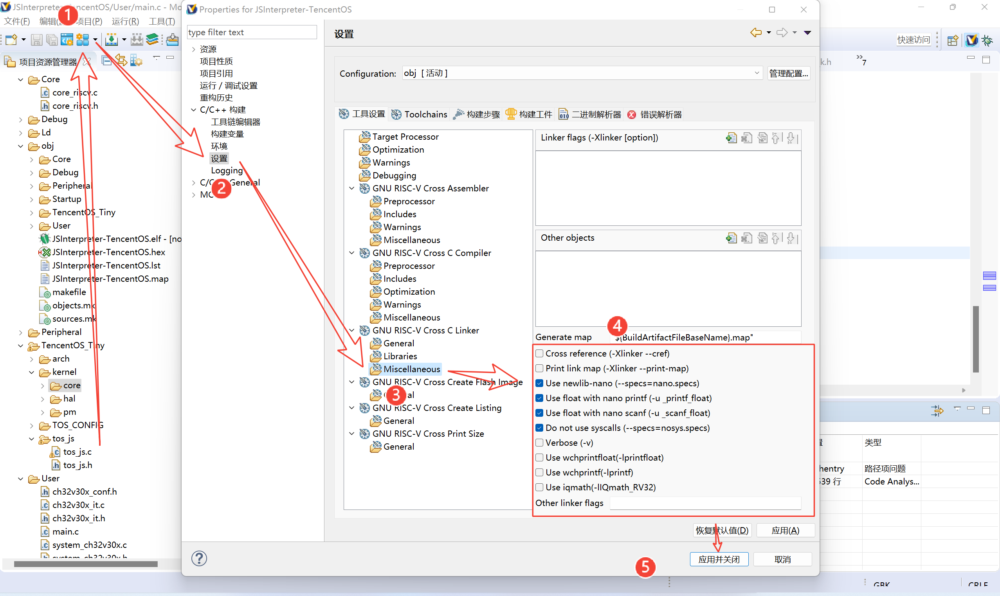

# 基于TencentOS Tiny移植JS解释器
此方案是建基于TencentOS Tiny CH32V\_EVB RISC-V开发套件。开发板是采用沁恒RISC-VMCUCH32V307VCT6芯片，CH32V305/7系列是基于沁恒自研RISC-V架构微处理器青稞V4系列设计的32位工业级互联型微控制器，配备了硬件堆栈区、快速中断入口，在标准RISC-V基础上大大提高了中断响应速度。加入单精度浮点指令集，扩充堆栈区，具有更高的运算性能。扩展串口UART数量到8组，定时器到10组，其中4组高级定时器。提供USB2.0高速接口（480Mbps）并内置了PHY收发器，而以太网MAC升级到千兆并集成了10M-PHY模块，并且板载有esp8266 WiFi模组，支持腾讯云固件，这样提供了强大多元化的网络传输能力。同时板载有1.54寸 IPS高清显示屏，支持240\*240分辨率，可以即时反馈相关的数据信息。再结合TencentOS Tiny开源[物联网操作系统](https://cloud.tencent.com/product/tos-tiny?from=10680)简便快速的开发如虎添翼。配合腾讯云[物联网开发平台IoT Explorer](https://cloud.tencent.com/product/iotexplorer?from=10680) 和腾讯连连小程序能高效地开发出基于物联网应用技术的智能设备。

移植方案主要采用主流JS解决方案。考察并尝试过多个JS解释器，包括但不限于QuickJS、MuJS、ELK等，最终选择了最为轻量的ELK解释器作为移植的主要工作。




主要的IDE采用沁恒自主研发的[MounRiver IDE](http://www.mounriver.com/)


我看TencentOS Tiny原本的架构图里是有支持JS引擎的。但可能由于时间问题还没有上线，所以我这边自己移植一个。

ELK框架的地址是[https://github.com/cesanta/elk](https://github.com/cesanta/elk)

核心文件非常精简，一共只有两个文件，elk.h和elk.c

elk.c：[https://github.com/cesanta/elk/blob/master/elk.c](https://github.com/cesanta/elk/blob/master/elk.c)

elk.h：[https://github.com/cesanta/elk/blob/master/elk.h](https://github.com/cesanta/elk/blob/master/elk.h)

由于这两个文件都仅依赖C语言的标准库，而不依赖任何其他的系统库（不依赖POSIX/Linux等库），所以非常适合移植到嵌入式设备之中。


#### 步骤1 新建工程





#### 步骤2 移动文件
在将这两个文件移动到新建的tos\_js目录下之后，目录应当如下所示



#### 步骤3 配置编译器和链接器
在这里，需要加入编译器的Include路径，使得编译器可以找到这个头文件，具体的步骤是



按照如上步骤将tos\_js目录添加到Include Paths中。

接下来需要开启一下编译器的浮点数支持，我们在平时在特定平台（Win，Mac，Linux）编程时，这个开关默认是开启的，但是对于嵌入式的GCC来说，这个开关默认是关闭的， 需要我们自行开启，如果不开启，就无法正确处理输出输出函数对于浮点数的支持，如sprintf/printf/scanf等函数对于浮点数的支持

开启浮点数的支持需要调整两个地方，第一个地方如下图所示，将步骤4圈出来的表格按照截图中填写，然后点击“应用并退出”



开启浮点数支持的第二个地方如下图所示。



调整完如上两个地方后，浮点数的支持就成功开启了，具体的测试步骤可以在main函数中编写如下语句

```cpp
printf("%f", 3.1);
```
或者类似的语句进行测试

#### 步骤4 进行JS的移植
接下来开启移植的过程。首先熟悉一下TencentOS Tiny的编程思路。

```cpp
int main(void) {
    USART_Printf_Init(115200);
    printf("SystemClk:%d\r\n", SystemCoreClock);

    printf("Welcome to TencentOS tiny(%s)\r\n", TOS_VERSION);
    tos_knl_init();
    tos_task_create(&task1, "task1", task1_entry, NULL, 3, task1_stk,
    TASK1_STK_SIZE, 0); // Create task1
    tos_task_create(&task2, "task2", task2_entry, NULL, 4, task2_stk,
    TASK2_STK_SIZE, 0); // Create task2
    tos_knl_start();

    printf("should not run at here!\r\n");

    while(1)
    {
        asm("nop");
    }
}
```
TencentOS Tiny最为显著的功能就是其任务调度功能，可以看出，在`main`函数中创建并运行了两个任务。分别是`task1`和`task2` ，那么我们具体的去看到`task1`的内容。

```cpp
void task1_entry(void *arg) {
    while (1)
    {
        printf("###I am task1\r\n");
        tos_task_delay(2000);
    }
}
```
非常的精简，没有多余的内容，核心就是一个延时函数`tos_task_delay` 。

那么我们可以基于ELK来移植JS解释器。

```cpp
#include "tos_js.h"
char js_mem[2000];
void task2_entry(void *arg) {
    struct js *js =  js_create(js_mem, sizeof(js_mem));
    js_set(js, js_glob(js), "print", js_mkfun(js_print));
    js_run(js, "let a = 1;");
    while (1)
    {
        printf("***I am task2\r\n");
        js_run(js, "print(a);a *= 2;");
        tos_task_delay(1000);
    }
}
```
这个ELK解释器和其他JS解释器略有不同，考虑到嵌入式设备不能很方便地进行内存的分配和回收，所以ELK是基于一块固定的内存进行存储的。所有的栈空间和JS虚拟机都存在于`js_mem` 这块内存之中，非常的便捷。

##### JS编程实例1 累乘
```cpp
#include "tos_js.h"
char js_mem[2000];
void task2_entry(void *arg) {
    struct js *js =  js_create(js_mem, sizeof(js_mem));
    js_run(js, "let a = 1;");
    while (1)
    {
        jsval_t res = js_run(js, "a *= 2;a");
        printf("res: %s", js_str(js, res));
        tos_task_delay(1000);
    }
}
```
一个最简单的程序如上图所示，可以看出，核心的步骤就是定义js虚拟机需要的内存空间`js_mem`* ，使用*`js_create` 函数初始化JS虚拟机，并使用`js_run` 函数运行指定的`JavaScript` 语句。并且这些JS的对象和值都可以与C语言无缝衔接。最后调用`js_str` 函数将一个JS对象转化为C语言的的字符串，非常地便捷。

##### JS编程实例2 JS调用C语言定义的函数
```cpp
#include "tos_js.h"
jsval_t js_print(struct js *js, jsval_t *args, int nargs) {
    for (int i = 0; i < nargs; i++) {
        const char *space = i == 0 ? "" : " ";
        printf("%s%s", space, js_str(js, args[i]));
    }
    putchar('\n');
    return js_mkundef();
}

char js_mem[2000];

void task2_entry(void *arg) {
    struct js *js =  js_create(js_mem, sizeof(js_mem));
    js_set(js, js_glob(js), "print", js_mkfun(js_print));
    js_run(js, "let a = 1;");
    while (1)
    {
        js_run(js, "a *= 2; print('res:', a);");
        tos_task_delay(1000);
    }
}
```
在本示例中定义了一个函数叫做`js_print`，这个函数的主要作用是起承接JS和C语言的桥梁，函数本身是用C语言编写的，但是可以使用JS对象（即`jsval_t类型`）作为参数，而且可以使用`js_set` 在JS中全局声明这个函数为`print` ，从此以后，就可以直接在JS代码中使用`print` 函数了，参考上述代码第19行，可以在JS中无缝与C语言进行对接。

